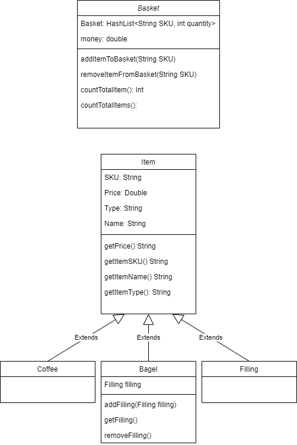

## Assumption
When adding a filling, it has to add to a bagel which then adds it to the basket. A bagel can only have 1 filling.
When removing a filling, it also removes it from the bagel.
Basket holds Coffee, Filling and Bagel but to know what your filling your bagel has, its bagel.getFilling().

## Class Basket
| Variables                                    | Method                           | Scenario                                                       | Outcome                              |
|----------------------------------------------|----------------------------------|----------------------------------------------------------------|--------------------------------------|
| HashMap<String SKU, Integer quantity> basket | addItemToBasket(String SKU)      | Add entry in HashMap if item does not exist in HashMap         | {"SKU", 1}                           |
| double money                                 |                                  | If Item already exist in HashMap, increment the quantity value | {"SKU", 2}                           |
|                                              |                                  | If item does not exist in shop, give error/warning             | "Item does not exist"                |
|                                              | removeItemFromBasket(String SKU) | Remove item from basket if it exist                            | "SKU has been removed"               |
|                                              |                                  | If the item does not exist, give error/warning                 | "Item does not exist"                |
|                                              | checkAllItems()                  | Return HashMap of all items, (E.g. with X quantity)            | HashMap<String SKU, Integer quantity |
|                                              |                                  |                                                                | "basket is empty"                    |
|                                              | countTotalItems()                | Return a number of total items in basket                       | "X items in basket"                  |
|                                              |                                  |                                                                | 0                                    |
|                                              | getItemFromKey(String SKU)       | Get the key                                                    |                                      |

## Class Item
| Variables    | Method       | Scenario                        | Outcome               |
|--------------|--------------|---------------------------------|-----------------------|
| String SKU   | getPrice()   | Get the price of a type of item | The price             |
| double Price |              |                                 | "Item does not exist" |
| String type  | getItemSKU() | Get the SKU name of the item    | SKU                   |
| String name  |              |                                 | "Item does not exist" |
|              | getItemName  | Get the name of the item        | "Bagel - Onion"       |
|              |              |                                 | "Item does not exist" |
|              | getItemType  | Get the type of item            | "Bagel"               |

## Class Bagel extends Item
| Variables       | Method                      | Scenario                         | Outcome                  |
|-----------------|-----------------------------|----------------------------------|--------------------------|
| Filling filling | addFilling(Filling filling) | Add filling to bagel             | Bagel.filling = filling  |
|                 |                             |                                  | "Filling does not exist" |
|                 | getFilling()                | Get what filling is on the bagel | "Bagel has X filling"    |
|                 |                             |                                  | "Filling does not exist" |
|                 | removeFilling()             | Remove the filling of the bagel  | bagel.filling = null     |

## Class Filling extends Item
| Variables | Method | Scenario | Outcome |
|-----------|--------|----------|---------|
|           |        |          |         |
|           |        |          |         |
|           |        |          |         |
|           |        |          |         |
|           |        |          |         |

## Class Coffee extends Item
| Variables | Method | Scenario | Outcome |
|-----------|--------|----------|---------|
|           |        |          |         |
|           |        |          |         |
|           |        |          |         |
|           |        |          |         |
|           |        |          |         |

## Class diagram

