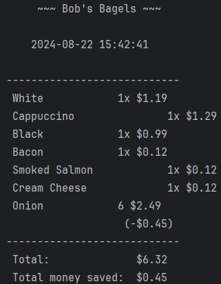

# Extension Domain Model

I'm using all the functionality from core assignment into my extension but adding more functionality to meet the extension assignment

Bagel discount is priority over bagel + coffee discount. So if we have 5 bagels in basket and the user adds a bagel and coffee, the user will get 6 bagel discount rather than coffee and bagel discount.

If basket has 6 bagels and 3 of them has filling, it will give a discount on the bagels and not the filling. The price will be bagel with discount + the filling.

The reason why discountManager and Receipt is extending from ItemList is to easier get the price, type and name for each item in the basket.

## DiscountManager extends ItemList
| Variable                                | Method                                                | Scenario                                                                                                                          | Outcome                                                                                                                                                                                                                           |
|-----------------------------------------|-------------------------------------------------------|-----------------------------------------------------------------------------------------------------------------------------------|-----------------------------------------------------------------------------------------------------------------------------------------------------------------------------------------------------------------------------------|
| HashMap<String, Integer> discount       | calculateDiscounts(Basket basket)                     | Calculate if there is any discounts in the baskets                                                                                | The new price of all products with discounts, then put that discount into a discount HashMap with the quantity. For instance, 24 onion bagels = (12BagelDiscount, 2). Remove the quantity in basket and use discount map instead. |
| HashMap<String, Integer> basket;        |                                                       |                                                                                                                                   | No discount, default pricing                                                                                                                                                                                                      |
| HashMap<String, Double> discountBasket; | totalValueOfDiscount()                                | Get the discounted price of a discount. discountBasket holds the total value of the discount of that item                         | The total price of the discount                                                                                                                                                                                                   |
| HashMap<String, String> typeList;       |                                                       |                                                                                                                                   | 0 if discount is empty                                                                                                                                                                                                            |
| ArrayList<String> bagelSKU;             | checkBagelDiscount(HashMap<String, Integer>): Integer | Check if there is enough bagels for a discount. If it is, add to discountBasket and return  the new quantity of item to basket    | So if there are 6 bagels of the same type in basket, return 6 so it can remove from original basket so it cannot discount again.                                                                                                  |
| ArrayList<String> coffeeSKU;            |                                                       |                                                                                                                                   | Return 0 if there are no discounts                                                                                                                                                                                                |
| double totalPrice = 0;                  | populateSKUList()                                     | A method to populate an arrayList with all SKU from coffee and Bagel. Makes it easier to check if the item is a bagel or a coffee | Populates the arrayList                                                                                                                                                                                                           |

## Receipt extends ItemList
| Variable                                | Method                              | Scenario                                                                              | Outcome                                                          |
|-----------------------------------------|-------------------------------------|---------------------------------------------------------------------------------------|------------------------------------------------------------------|
| HashMap<String, Integer> basket;        | calculateBasket(): float            | Calculate the price of all items in basket                                            | a float value of the total price                                 |
| HashMap<String, Float> discountBasket;  | calculateOriginalBasket(): float    | Calculate the price of basket before adding discount                                  |                                                                  |
| DiscountManager discountManager;        | printOutReceipt(): float            | Print out the receipt and the return value is the total price                         | Receipt of the basket as a fine print and return the total price |
| HashMap<String, Integer> numberOfItems; |                                     |                                                                                       |                                                                  |
|                                         | checkBagelDiscountInBasket(): void  | Check if there is a bagelDiscount in basket, 6 bagels, 12 bagels, or bagel and coffee |                                                                  |

