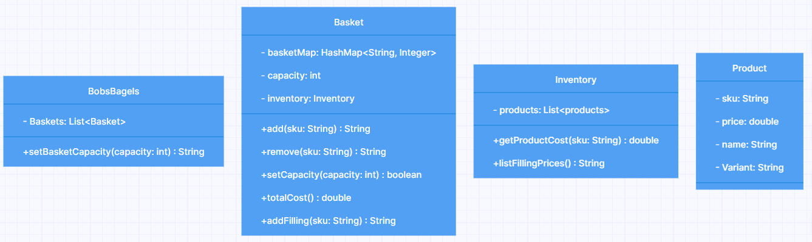

# Domain model Bob's Bagels
```
BobsBagels
	- Baskets: List<Basket>
	+ setBasketCapacity(capacity: int) String

Basket
	- basketMap: HashMap<String, Integer>
	- capacity: int
	- inventory: Inventory
	+ add(sku: String) String
	+ remove(sku: String) String
	+ setCapacity(capacity: int) boolean
	+ totalCost() double
	+ addFilling(sku: String) String

Inventory
	- products: List<products>
	+ getProductCost(sku: String) double
	+ listFillingPrices() String

Product
	- sku: String
	- price: double
	- name: String
	- Variant: String
```
```
1.
As a member of the public,
So I can order a bagel before work,
I'd like to add a specific type of bagel to my basket.
```
| Class  | Method          | Variables                          | Scenario                                                                                  | Return value |
|--------|-----------------|------------------------------------|-------------------------------------------------------------------------------------------|--------------|
| Basket | add(String sku) | HashMap<String, Integer> basketMap | Empty / Invalid SKU input                                                                 | Return false |
|        |                 |                                    | Valid SKU input, basket does not contain product, product added to basketMap with value 1 | Return True  |
|        |                 |                                    | Valid SKU input, basket already contains product, value for product increased by 1        | Return True  |
```
2.
As a member of the public,
So I can change my order,
I'd like to remove a bagel from my basket.
```
| Class  | Method             | Variables                          | Scenario                                                                                       | Return value |
|--------|--------------------|------------------------------------|------------------------------------------------------------------------------------------------|--------------|
| Basket | remove(String sku) | HashMap<String, Integer> basketMap | Empty / Invalid SKU input                                                                      | Return false |
|        |                    |                                    | Valid SKU input, basket contains multiple of product, 1 of product removed from products value | Return True  |
|        |                    |                                    | Valid SKU input, basket contains only 1 of product, product removed from basketMap             | Return True  |
```
3.
As a member of the public,
So that I can not overfill my small bagel basket
I'd like to know when my basket is full when I try adding an item beyond my basket capacity.
```
| Class  | Method          | Variables                          | Scenario                                                                                  | Return value                     |
|--------|-----------------|------------------------------------|-------------------------------------------------------------------------------------------|----------------------------------|
| Basket | add(String sku) | HashMap<String, Integer> basketMap | Empty / Invalid SKU input                                                                 | Return "Product not found"       |
|        |                 | int capacity                       | Valid SKU input, basket does not contain product, product added to basketMap with value 1 | Return "Product added to basket" |
|        |                 |                                    | Valid SKU input, basket already contains product, value for product increased by 1        | Return "Product added to basket" |
|        |                 |                                    | Basket already full, nothing added to basket                                              | Return "Basket is full"          |
```
4.
As a Bob's Bagels manager,
So that I can expand my business,
I’d like to change the capacity of baskets.
```
| Class      | Method                          | Variables    | Scenario                                                                                                                        | Return value                                                                               |
|------------|---------------------------------|--------------|---------------------------------------------------------------------------------------------------------------------------------|--------------------------------------------------------------------------------------------|
| BobsBagels | setBasketCapacity(int capacity) |              | Capacity is lowered beyond a baskets number of items, the capacity is changed, but manager is warned                            | Return "Capacity set to (num). There are customers with more product than (num) in basket" |
|            |                                 |              | Capacity is set to negative number                                                                                              | Return "Minimum capacity for baskets are 0"                                                |
|            |                                 |              | Capacity is set to a number above zero and above or equal to the customer with the most items                                   | Return "Capacity set to (num)"                                                             |
| Basket     | setCapacity(int capacity)       | int capacity | Capacity is set to a positive int                                                                                               | Return true                                                                                |
|            |                                 |              | Capacity is set to a negative number or zero                                                                                    | Return false                                                                               |
|            |                                 |              | Capacity is set to number lower than this baskets number of products. Allowed, but customer won't be able to add any more items | Return true                                                                                |
```
5.
As a member of the public
So that I can maintain my sanity
I'd like to know if I try to remove an item that doesn't exist in my basket.
```
| Class  | Method             | Variables                          | Scenario                                                                                       | Return value                         |
|--------|--------------------|------------------------------------|------------------------------------------------------------------------------------------------|--------------------------------------|
| Basket | remove(String sku) | HashMap<String, Integer> basketMap | Empty / Invalid SKU input                                                                      | Return "Product is not in basket"    |
|        |                    |                                    | Valid SKU input, basket contains multiple of product, 1 of product removed from products value | Return "Product removed from basket" |
|        |                    |                                    | Valid SKU input, basket contains only 1 of product, product removed from basketMap             | Return "Product removed from basket" |

```
6.
As a customer,
So I know how much money I need,
I'd like to know the total cost of items in my basket.
```
| Class  | Method      | Variables                          | Scenario                           | Return value                        |
|--------|-------------|------------------------------------|------------------------------------|-------------------------------------|
| Basket | totalCost() | HashMap<String, Integer> basketMap | Basket has multiple products in it | Return sum of all products (double) |
|        |             |                                    | Basket is empty                    | Return 0                            |
```
7.
As a customer,
So I know what the damage will be,
I'd like to know the cost of a bagel before I add it to my basket.
```
| Class     | Method                     | Variables                   | Scenario        | Return value                 |
|-----------|----------------------------|-----------------------------|-----------------|------------------------------|
| Inventory | getProductCost(String sku) | ArrayList<Product> products | Valid SKU input | Return product cost (double) |
|           |                            |                             | SKU not found   | Return -1                    |
```
8.
As a customer,
So I can shake things up a bit,
I'd like to be able to choose fillings for my bagel.
```
| Class  | Method                 | Variables                          | Scenario                                                                                              | Return value                                    |
|--------|------------------------|------------------------------------|-------------------------------------------------------------------------------------------------------|-------------------------------------------------|
| Basket | addFilling(String sku) | HashMap<String, Integer> basketMap | Filling added to basketMap with bagel in it                                                           | Return "Filling added"                          |
|        |                        |                                    | Filling added to basketMap without bagel in it, do not add                                            | Return "You need to add a bagel to your basket" |
|        |                        |                                    | SKU not found                                                                                         | Return "Filling was not found"                  |
|        |                        |                                    | SKU is found, but does not refer to a filling                                                         | Return "Product needs to be a filling"          |
|        |                        |                                    | Filling added to full basket. addFilling uses add() method for adding, and therefore has same return. | Return "Basket is full"                         |
```
9.
As a customer,
So I don't over-spend,
I'd like to know the cost of each filling before I add it to my bagel order.
```
| Class     | Method             | Variables                   | Scenario                                                           | Return value                              |
|-----------|--------------------|-----------------------------|--------------------------------------------------------------------|-------------------------------------------|
| Inventory | listFillingCosts() | ArrayList<Product> products | Fillings are organized into a String with fillings and their price | Return String list of fillings with price |
|           |                    |                             | No fillings in products list                                       | Return "No fillings available"            |
```
10.
As the manager,
So we don't get any weird requests,
I want customers to only be able to order things that we stock in our inventory.
```
#### Inventory class implemented

# Class diagram:
