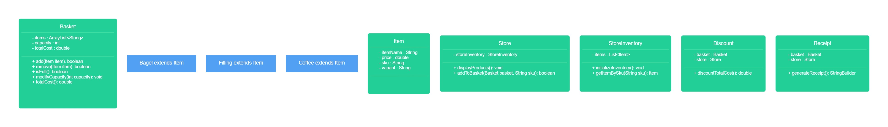

# Domain model from previous bob's bagels

## User Stories

```
1.
As a member of the public,
So I can order a bagel before work,
I'd like to add a specific type of bagel to my basket.
```

| Method           | Member variables        | Scenario                 | Output/Results |
|------------------|-------------------------|--------------------------|----------------|
| add(String item) | ArrayList<String> items | If bagel *doesn't* exist | true           |
|                  |                         | If bagel *does* exist    | false          |


```
2.
As a member of the public,
So I can change my order,
I'd like to remove a bagel from my basket.
```

| Method              | Member variables        | Scenario                          | Output/Results |
|---------------------|-------------------------|-----------------------------------|----------------|
| remove(String item) | ArrayList<String> items | If item *does* exists in basket   | true           |
|                     |                         | If item *doesn't* exist in basket | false          |


```
3.
As a member of the public,
So that I can not overfill my small bagel basket
I'd like to know when my basket is full when I try adding an item beyond my basket capacity.
```

| Method   | Member variables        | Scenario                | Output/Results |
|----------|-------------------------|-------------------------|----------------|
| isFull() | ArrayList<String> items | If basket *is* full     | true           |
|          |                         | If basket *isn't* full  | false          |


```
4.
As a Bob's Bagels manager,
So that I can expand my business,
I’d like to change the capacity of baskets.
```

| Member variables                 | Scenario                                                | Output/Results |
|----------------------------------|---------------------------------------------------------|----------------|
| ArrayList<String> enhancedBasket | Customers can now choose which baskets they want to use | ...            |
|                                  |                                                         |                |


```
5.
As a member of the public
So that I can maintain my sanity
I'd like to know if I try to remove an item that doesn't exist in my basket.
```

| Method              | Member variables        | Scenario                          | Output/Results |
|---------------------|-------------------------|-----------------------------------|----------------|
| remove(String item) | ArrayList<String> items | If item *does* exist in basket    | true           |
|                     |                         | If item *doesn't* exist in basket | false          |


```
6.
As a customer,
So I know how much money I need,
I'd like to know the total cost of items in my basket.
```

| Method      | Member variables | Scenario                         | Output/Results |
|-------------|------------------|----------------------------------|----------------|
| totalCost() | double totalCost | If items *do* exist in basket    | sum            |
|             |                  | If items *don't* exist in basket | 0              |


```
7.
As a customer,
So I know what the damage will be,
I'd like to know the cost of a bagel before I add it to my basket.
```

| Method      | Member variables       | Scenario                          | Output/Results              |
|-------------|------------------------|-----------------------------------|-----------------------------|
| getPrice()  | private String variant | If bagel *does* exist in list     | "This bagel costs: " + cost |
|             |                        | If item *doesn't* exist in basket | "We do not sell this bagel" |


```
8.
As a customer,
So I can shake things up a bit,
I'd like to be able to choose fillings for my bagel.
```

| Method          | Member variables                  | Scenario                           | Output/Results |
|-----------------|-----------------------------------|------------------------------------|----------------|
| checkFillings() | HashMap<String, Integer> fillings | If filling *does* exist in list    | true           |
|                 |                                   | If filling *doesn't* exist in list | false          |


```
9.
As a customer,
So I don't over-spend,
I'd like to know the cost of each filling before I add it to my bagel order.
```

| Method        | Member variables                  | Scenario                           | Output/Results |
|---------------|-----------------------------------|------------------------------------|----------------|
| fillingCost() | HashMap<String, Integer> fillings | If fillings *does* exist in map    | true           |
|               |                                   | If fillings *doesn't* exist in map | false          |


```
10.
As the manager,
So we don't get any weird requests,
I want customers to only be able to order things that we stock in our inventory.
```

| Method          | Member variables           | Scenario                                       | Output/Results |
|-----------------|----------------------------|------------------------------------------------|----------------|
| controlOrders() | ArrayList<String> products | If item requested *does* exist in inventory    | true           |
|                 |                            | If item requested *doesn't* exist in inventory | false          |


### Class diagram


#### New class diagram

