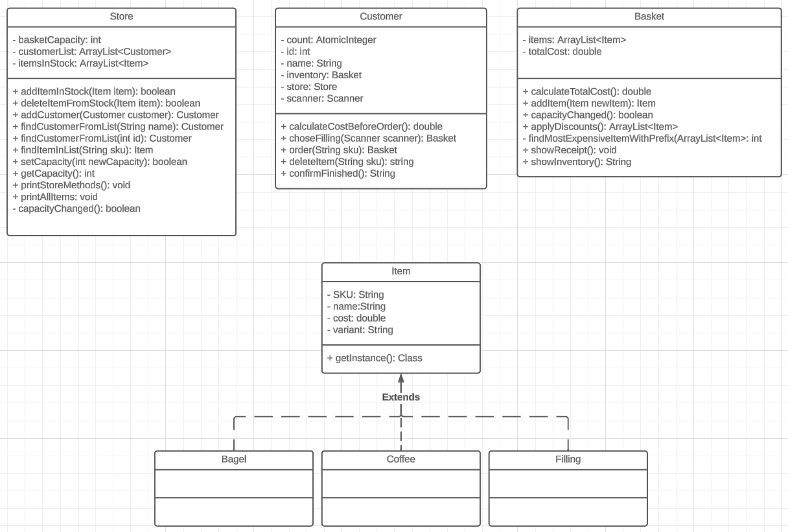

```
1.
As a member of the public,
So I can order a bagel before work,
I'd like to add a specific type of bagel to my basket.
```
Customer

| method            | object variables | context                                               | output/return         |
|-------------------|------------------|-------------------------------------------------------|-----------------------|
| order(String sku) | Basket basket    | If there are capacity, add an item with matching SKU. | (boolean) wasAdded    |
|                   |                  | If basket is full, don't add bagel to basket          | (boolean) wasNotAdded |
---
```
2.
As a member of the public,
So I can change my order,
I'd like to remove a bagel from my basket.
```
Customer

| method             | object variables | context                                                                                                 | output/return                             |
|--------------------|------------------|---------------------------------------------------------------------------------------------------------|-------------------------------------------|
| delete(String sku) | Basket basket    | If input matches an Item, delete Item from Basket </br> If input does not match a bagel, change nothing | return (String) "{name} has been deleted" |
|                    |                  |                                                                                                         | return (String) "{name} was not found"    |

---
```
3.
As a member of the public,
So that I can not overfill my small bagel basket
I'd like to know when my basket is full when I try adding an item beyond my basket capacity.
```
Customer

| method            | object variables | context                                                           | output/return             |
|-------------------|------------------|-------------------------------------------------------------------|---------------------------|
| order(String sku) | Basket basket    | If there are capacity, add a Item with matching SKU to the basket | return true if added      |
|                   |                  | If basket is full, don't add Item to basket                       | return false if not added |

---
```
4.
As a Bob's Bagels manager,
So that I can expand my business,
I’d like to change the capacity of baskets.
```
Store

| method                       | object variable          | context                                                                                                                                                                                                                                                                                           | output/return |
|------------------------------|--------------------------|---------------------------------------------------------------------------------------------------------------------------------------------------------------------------------------------------------------------------------------------------------------------------------------------------|---------------|
| setCapacity(int newCapacity) | ArrayList<String> bagels | update global variable 'capacity'. If newCapacity is lower than oldCapacity, iterate over all Customer's Baskets. </br> If a holder have less bagels than the new capacity, do nothing </br>If a holder have more bagels than the new capacity, delete the newest bagels. New holder is now full. |               |
|                              | int capacity             |                                                                                                                                                                                                                                                                                                   |               |

---
```
5.
As a member of the public
So that I can maintain my sanity
I'd like to know if I try to remove an item that doesn't exist in my basket.
```
Basket

| method                  | object variables      | context                                                                                                                                    | output/return                                     |
|-------------------------|-----------------------|--------------------------------------------------------------------------------------------------------------------------------------------|---------------------------------------------------|
| deleteItem(String name) | ArrayList<Item> items | Iterates over ArrayList<Item> to find a Item with matching name. If found, delete the Item and return true </br>If not found, return false | (boolean) foundAndDeleted </br>(boolean) notFound |

___
```
6.
As a customer,
So I know how much money I need,
I'd like to know the total cost of items in my basket.
```

Basket

| method               | object variables      | context                                                         | output/return              |
|----------------------|-----------------------|-----------------------------------------------------------------|----------------------------|
| calculateTotalCost() | ArrayList<Item> items | If ArrayList<Item> has elements, return the sum of the elements | (double) totalCost         |
|                      |                       | If ArrayList<Item> is empty, return 0.0                         | (double) totalIsZero = 0.0 |

---
```
7.
As a customer,
So I know what the damage will be,
I'd like to know the cost of a bagel before I add it to my basket.
```
Customer

| method                     | object variables | context                                 | output/return              |
|----------------------------|------------------|-----------------------------------------|----------------------------|
| calculateCostBeforeOrder() | Basket inventory | calls and returns calculateTotalCost()  | (double) totalCost         |

---

```
8.
As a customer,
So I can shake things up a bit,
I'd like to be able to choose fillings for my bagel.
```

Customer

| method                    | object variables | context                                                                                                                                                                                             | output/return          |
|---------------------------|------------------|-----------------------------------------------------------------------------------------------------------------------------------------------------------------------------------------------------|------------------------|
| chooseFilling(String sku) | Basket inventory | If basket contains one or more Bagels, print list of filling. User input SKU of filling. If a filling is chosen, add the filling to basket. </br>If filling with variant "none" is chosen, carry on | (Basket) updatedBasket |

---
```
9.
As a customer,
So I don't over-spend,
I'd like to know the cost of each filling before I add it to my bagel order.
```

Customer

| method                    | object variables | context                                                                                                                                                                                             | output/return |
|---------------------------|------------------|-----------------------------------------------------------------------------------------------------------------------------------------------------------------------------------------------------|---------------|
| chooseFilling(String sku) | Basket inventory | If basket contains one or more Bagels, print list of filling. User input SKU of filling. If a filling is chosen, add the filling to basket. </br>If filling with variant "none" is chosen, carry on | void          |

---
```
10.
As the manager,
So we don't get any weird requests,
I want customers to only be able to order things that we stock in our inventory.
```

Customer

| method            | object variables | context                                                                                                                             | output/return                           |
|-------------------|------------------|-------------------------------------------------------------------------------------------------------------------------------------|-----------------------------------------|
| order(String sku) | Basket inventory | If String matches a SKU in Store.ItemsInStock, add Item to basket. </br>If String does not match a SKU, print error message to user | (boolean) added </br>(boolean) notAdded |

---
```
11.
As a customer,
So I don't overspend,
I want the shop to automatically consider and apply the best discounts for me.
```


| method                        | object variables                                        | context                                                                                                                                                   | output/return                               |
|-------------------------------|---------------------------------------------------------|-----------------------------------------------------------------------------------------------------------------------------------------------------------|---------------------------------------------|
| applyDiscounts(Basket basket) | Basket inventory</br>HashMap<Item, Integer> itemCounter | Put every item in Basket to HashMap and count each item in Basket. Copy ArrayList<Item>, apply discounts and remove items until copied ArrayList is empty | (ArrayList<Item> basketWithAppliedDiscounts |

---
