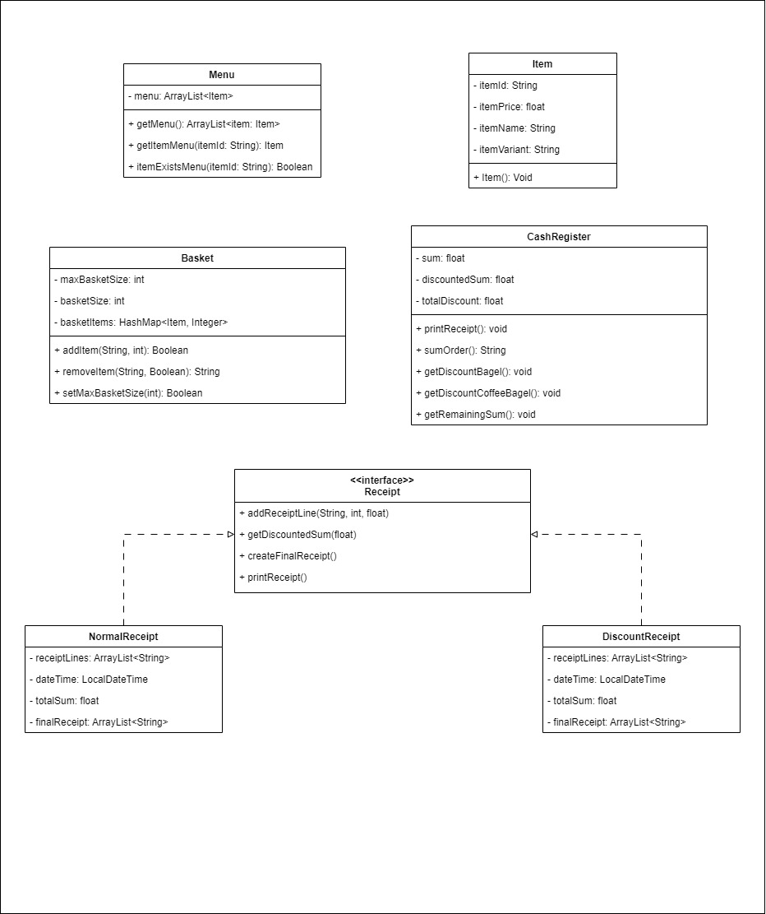

## Class diagram

### Item class
| Method   | Scenario          | Output |
|----------|-------------------|--------|
| `Item()` | Class constructor | -      |

### Menu class
| Method                        | Scenario                                            | Output         |
|-------------------------------|-----------------------------------------------------|----------------|
| `getMenu()`                   | -                                                   | List of menu   |
| `itemExists(itemId: String)`  | Item exists in menu Item does not exist in menu | true false |
| `getItemMenu(itemId: String)` | Item exists in menu Item does not exist in menu | Item null  |

### Basket class

| Method                                                  | Scenario                                                                                                                                         | Outcome                                                                                                                    | Output                                                                                                                                                                      |
|---------------------------------------------------------|--------------------------------------------------------------------------------------------------------------------------------------------------|----------------------------------------------------------------------------------------------------------------------------|-----------------------------------------------------------------------------------------------------------------------------------------------------------------------------|
| `addItem(itemId: String, quantity: int)`                | Item exists in menu but not in basketItems Item exists in menu and in basketItems Item does not exist in menu Basket is full         | Item is added to basketItems with the correct quantity The quantity of the item in basketItems is changed -  - | "'quantity' 'itemVariant' 'itemName' added to basket." "'quantity' 'itemVariant' 'itemName' added to basket." "This item is not on the menu." "Basket is full." |
| `removeItem(itemId: String, removeDuplicates: Boolean)` | Item exists in basketItems and removeDuplicates=true Item exists in basketItems and removeDuplicates=false Item does not exist in basket | Entry is removed from basketItems The quantity of the item in basketItems is subtracted 1. -                       | "'quantity' 'itemVariant' 'itemName's removed from basket." "'itemVariant' 'itemName' removed from basket." "This item does not exist in your basket."              |
| `sumOrder()`                                            | basketItems is not empty basketItems is empty                                                                                                |                                                                                                                            | "The sum of your order is: 'sum'" "Your basket is empty."                                                                                                               |
| `sumOrderDiscount()`                                    | 6 bagels of any kind 12 bagels of any kind 1 bagel and 1 coffee                                                                          | Sum = 2.49 Sum = 3.99 Sum = 1.25                                                                                   |  "The sum of your order is: 'sum'"                                                                                                                                                                           |
| `setBasketSize(int)`                                    | Basket capacity is changed to a positive integer by a "manager" Basket capacity value is not positive                                        |                                                                                                                            | Return true Return false                                                                                                                                                |

### Assumptions:

- Fillings can be added regardless of the presence of a bagel in the basket.
- Fillings, coffee, and bagels count toward the maximum basket size.
- The "manager" role is purely fictional and not actually implemented